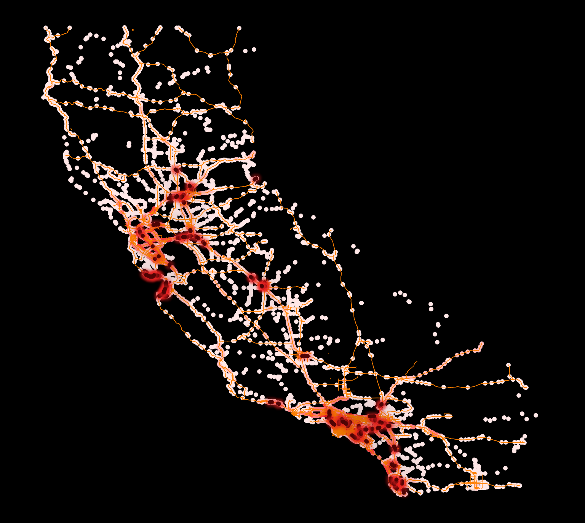

# Annual Average Daily Traffic and Bottleknecks in California Final Project

## Project Table of Contents

- [Data Source](#data-source)

- [Project Background](#project-background)

- [Purpose](#purpose)

- [Mapmaking Process](#mapmaking-process)

- [Map summary](#map-summary)

- [Final Project Link](#final-project-link)

***

### Data Source

* [CA State Geoportal: Traffic Volumes AADT](https://gis.data.ca.gov/datasets/d8833219913c44358f2a9a71bda57f76_0/about)
* [CA State Geoportal: Bottlenecks](https://gis.data.ca.gov/datasets/9509bf8a475f49b4a9c79bac15f8b479_0/about)

* [CA State Geoportal: National Highway System](https://gis.data.ca.gov/datasets/1f71fa512e824ff09d4b9c3f48b6d602_0/about)

* ***Initial Data projection:*** EPSG:4326 - WGS 84
* ***Final Map projection:*** EPSG:3310 - NAD83 / California Albers

### Project Background

* For this project I wanted to focus on a topic relating to road networks. This map compiles the instances of the total sum of automobiles which have crossed at a given point. Additionally the map shows designated areas of "Bottlenecks" which are defined by the number of automobiles and their speed at an area, which is tracked by California Department of Transportation (Caltrans). Much of the cartography and design was inspired by Mamata Akella's [Global Shipping Traffic map](https://felt.com/map/Global-Shipping-Traffic-wQbBGUlVQHqd2pFCXjC2gB?loc=52.95,-132.59,3z). Although her map is using raster data of shipping traffic, the data here is created in a CSV and then to point data. When catagorized and at the scale of CA, I really enjoyed how the points created a raster pixel like illistration of the data. I also wanted to communicate the data in focusing on the overall picture or representation of the data rather than the specific numerical details.

### Purpose

* For this map I wanted to make one that was intuitive of showing daily traffic in California, not in one particular area, but the state as a whole and not with quantitative numbers but visually through color. I wanted to illustrate how some areas although are heavily traversed aren’t bottlenecks or how the opposite might be true as well as the over all pattern of daily traffic in CA.  

### Mapmaking Process

* To begin the process I started with Annual Average Daily Traffic(AADT) points
  

* Then  I found designated “Bottleneck” locations deemed so by the California Department of Transportation (Caltrans). I then also found interstate highway polylines and overlayed them

* The polylines alone would not select to the point data, so I made a small buffer polygon of the highway geometry. I then did a select by location where the AADT points intersect or touched the new highway geometry and exported the relevant points.

* I then performed it again, but in reverse to remove the unnecessary highway geometry (especially for LA that was quite dense at this scale) 

***Before:***

***After:***

* Next was to calculate total times a point was traversed using the field calculator:

"BACK_AADT" + "AHEAD_AADT"

* The next step is to change the symbology of the AADT points to ***Graduated*** and set the ***Value*** to the absolute totals. I then set the Color Ramp to Blue to Yellow and gave the Natural Breaks (jenks) classification with 9 class to give a nice gradient 

* The last step was change the symbology of the Bottlenecks, again to ***Graduated*** and the ***Value*** to Shape_length,  and creating a Natural Breaks (Jenks) classification with 5 classes.

### Map summary

* One of the key take ways I’ve learned while creating this map is although an area might be transversed frequently throughout the day,  bottlenecks in the flow of traffic may still be designated in less dense areas. While areas like Los Angeles (which have legendary levels of congestion) would be obvious areas for bottlenecks examples of rural bottlenecks can be seen along California's coast line or on it's boarder with Nevada.

## Final Project Link

Please view the [final map online](https://github.com/D-Guth3/CA-Traffic-and-Bottlenecks)